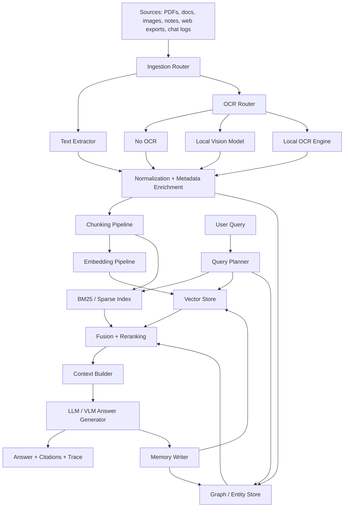

# JR-AutoRAG Upgrade Document
## Local-First, Cloud-Optional Architecture Plan

## 1. Purpose
This document upgrades the original research memo into a cleaner implementation plan for JR-AutoRAG. The goal is not just to make the stack stronger. The goal is to make it production-ready **without losing the ability to run fully local**.

The original report already identifies the right core themes: hybrid retrieval, stronger embeddings, better chunking, memory, monitoring, safety, and scalable infrastructure. This version keeps those foundations, but restructures them into a practical architecture with one hard rule:

**Every major subsystem must have a local-only path.**

That applies to:
- ingestion
- OCR
- embeddings
- reranking
- retrieval
- graph augmentation
- generation
- memory
- evaluation
- observability
- security controls

The result is a system that can operate in three modes:

| Mode | Description | Internet Required | Good For |
|---|---|---:|---|
| Local Only | All inference, storage, OCR, indexing, retrieval, and memory run on user-controlled hardware | No | privacy-first use, offline workflows, home lab, regulated data |
| Hybrid | Local core with optional cloud boosts for selected tasks | Optional | best balance of performance and cost |
| Cloud Accelerated | Cloud models and hosted infra allowed where useful | Yes | fastest iteration, highest ceiling, managed scale |

## 2. What changes from the original report
The source report is solid, but it leans too hard toward “best available” recommendations, which often drift cloudward. It also treats OCR as a preprocessing detail instead of a first-class configurable subsystem. That is the main thing to fix.

This upgrade changes the architecture in five important ways:

### 2.1 Local-only becomes a hard design constraint
The original report allows local deployment in places, but does not enforce it at the system level. This version does.

### 2.2 OCR becomes pluggable
OCR is no longer a hidden preprocessing step. It becomes an explicit pipeline stage with multiple local-capable options:
- no OCR when text is already extractable
- native vision-language model path
- dedicated local OCR engine path
- fallback hybrid path only if the user enables it

### 2.3 Model recommendations are split by deployment lane
Each layer now lists:
- local-first recommendation
- optional hybrid alternative
- optional cloud path

### 2.4 Production readiness is tied to failure handling
The original report covers monitoring and CI/CD. This version adds concrete operational rules for degraded mode behavior, model fallback order, cache strategy, and reproducibility.

### 2.5 Retrieval quality is treated as a pipeline problem
The source report focuses on embeddings and vector stores. This version treats ingestion, parsing, OCR, metadata, chunking, reranking, and memory as one retrieval system.

## 3. Current baseline from the original report
Based on the source document, JR-AutoRAG already has the right skeleton:
- hybrid retrieval with dense + BM25 + rank fusion + optional reranking
- a Python/FastAPI backend
- React/TypeScript frontend
- graph-related augmentation hooks
- security middleware and testing
- early support for scalable vector storage
- attention to chunking, evaluation, observability, and privacy

That is a good base. The next step is not to throw it out. The next step is to standardize it into a local-first upgrade path.

## 4. Architecture goals

### 4.1 Non-negotiables
1. Full local-only mode must remain possible.
2. Cloud services must always be optional.
3. Users must be able to choose model providers per subsystem.
4. OCR must be selectable, not mandatory.
5. Sensitive documents must never need to leave the machine unless the user explicitly enables that.
6. The system must degrade gracefully when GPU, memory, or internet constraints hit.

### 4.2 Product goals
1. Better retrieval accuracy
2. Better document understanding for messy PDFs and screenshots
3. Better long-session memory
4. Lower latency for common tasks
5. Stronger observability and evaluation
6. Easy deployment from laptop to workstation to server

## 5. Target system architecture



## 6. Deployment model
The cleanest way to keep local-only support without making the system messy is to define provider interfaces for every major capability.

### 6.1 Required provider interfaces
- `DocumentParserProvider`
- `OCRProvider`
- `EmbeddingProvider`
- `RerankerProvider`
- `VectorStoreProvider`
- `SparseIndexProvider`
- `GraphStoreProvider`
- `LLMProvider`
- `MemoryProvider`
- `EvalProvider`
- `TelemetryProvider`

Each provider should support at least these properties:
- `mode: local | hybrid | cloud`
- `requires_network: true | false`
- `supports_batching`
- `supports_streaming`
- `supports_multimodal`
- `estimated_latency_class`
- `estimated_memory_class`

That gives you one code path with swappable backends instead of one architecture per vendor.

## 7. OCR as a first-class subsystem
This is the most important requested change.

The system should not assume that OCR is always necessary. Many documents already contain extractable text. OCR should be used only when needed, and the user should be able to choose how.

### 7.1 OCR decision tree
1. Try native text extraction first.
2. If extracted text quality is good enough, skip OCR.
3. If the page is image-based, scanned, or layout-heavy, route to OCR.
4. Let the user choose the OCR backend policy:
   - `off`
   - `auto`
   - `vision_model`
   - `dedicated_ocr`
   - `hybrid`

### 7.2 Supported OCR modes

| OCR Mode | Description | Local-Only Capable | Best Use Case | Tradeoffs |
|---|---|---:|---|---|
| Off | Never run OCR | Yes | clean digital PDFs | fails on scans and screenshots |
| Native Vision Model | Use a local image-capable model to read pages directly | Yes | screenshots, forms, mixed-layout pages, charts, UI captures | slower than plain text extraction, may be weaker on tiny text |
| Dedicated OCR Engine | Use a specialized local OCR stack | Yes | scans, dense documents, predictable text-heavy pages | may need more post-processing for layout fidelity |
| Hybrid OCR | Run both and reconcile outputs | Yes, if both engines are local | high-value documents where accuracy matters most | higher latency and compute |

### 7.3 Recommended OCR architecture
Use an OCR router with confidence scoring.

```text
if extractable_text_confidence >= threshold:
    use extracted text
elif user_prefers_native_vision:
    run local VLM OCR
elif user_prefers_dedicated_ocr:
    run local OCR engine
else:
    run both locally, compare confidence, merge best result
```

### 7.4 Local OCR options
You specifically wanted the system to support either a native image model or something like GLM OCR or DeepSeek OCR while staying local. The right architectural answer is to support both classes.

#### Option A: Native local image model
Use a local vision-language model as the OCR path. This is the best choice when you want one model to do more than raw OCR, such as:
- reading screenshots
- interpreting UI layouts
- extracting tables approximately
- handling charts, figures, and diagrams
- turning page images into structured notes

This path is best when document understanding matters more than raw OCR speed.

#### Option B: Dedicated local OCR engine
Use a dedicated OCR backend for text extraction. This is the best choice when you want:
- fast page transcription
- high throughput on scans
- lower VRAM pressure than a large VLM
- deterministic text extraction for indexing

This path is best when the target is retrieval quality and large-batch ingestion.

#### Option C: Dual-path OCR
Run both on important documents:
- dedicated OCR for primary text extraction
- local vision model for layout rescue, captions, tables, and ambiguous regions

That gives you better accuracy without forcing VLM OCR on every page.

### 7.5 Practical recommendation
For production, make OCR configurable per corpus and per ingestion job:
- `text-first` for normal PDFs
- `ocr-fast` for scanned archives
- `ocr-vision` for screenshots and visually complex docs
- `ocr-dual` for high-value ingestion

### 7.6 Important note on exact OCR model choices
You named GLM OCR and DeepSeek OCR as examples. That is a valid product direction. I cannot verify the newest exact checkpoint names or current benchmark ranking in this environment, so the implementation should treat them as **backend classes** rather than hardcoded winners.

The stable design is:
- support any local GLM-based OCR-capable model you decide to ship
- support any local DeepSeek-family OCR or document-VLM backend you validate
- keep the same provider interface so you can swap checkpoints later without changing the ingestion architecture

## 8. Ingestion and parsing upgrades
The biggest gains usually come before retrieval.

### 8.1 Ingestion pipeline stages
1. file type detection
2. source trust tagging
3. text extraction
4. OCR routing if needed
5. document normalization
6. metadata enrichment
7. chunk generation
8. embedding and sparse indexing
9. quality checks
10. commit to stores

### 8.2 Required metadata per chunk
Every chunk should store:
- document ID
- source path
- title
- section header
- page number
- chunk index
- corpus ID
- language
- extraction method used
- OCR engine used if any
- extraction confidence
- last indexed timestamp
- security classification
- hash of raw text

Without this, evaluation and debugging get much harder.

### 8.3 Parsing strategy
Prefer a layered parser stack:
- native text parser first
- layout-aware parser second
- OCR fallback third
- VLM rescue fourth for difficult pages

This reduces cost and latency while preserving local-only capability.

## 9. Chunking strategy
The original report is right that chunking matters. This upgrade makes chunking adaptive.

### 9.1 Recommended chunking modes
| Mode | Best For | Recommendation |
|---|---|---|
| Fixed token chunking | fast baseline | keep as fallback only |
| Section-aware chunking | docs with headings | make default for most prose |
| Page-aware chunking | PDFs, reports, textbooks | use heavily |
| Semantic chunking | knowledge-dense or irregular text | optional premium path |
| Agentic chunking | very high-value corpora | research path, not v1 default |

### 9.2 Production default
Use a **hierarchical chunking pipeline**:
1. split by section or page
2. merge undersized blocks
3. cap to token target
4. add light overlap
5. attach rich metadata

This is a stronger default than plain 512-token sliding windows.

### 9.3 Retrieval-oriented rule
Chunk for retrieval, not for elegance. If a chunk reads beautifully but retrieves badly, it is the wrong chunk.

## 10. Embeddings
The original report recommends several strong embedding options. The upgrade here is to stop tying the design to one provider.

### 10.1 Embedding lane design

| Lane | Recommendation | Local-Only Capable | Notes |
|---|---|---:|---|
| Local baseline | BGE, E5, or similarly strong open embedding family | Yes | strong default for private deployments |
| Local high-end | larger multilingual embedding model if hardware allows | Yes | better recall, more RAM and latency |
| Hybrid | local by default, cloud only for special corpora | Optional | useful when a subset needs maximum quality |
| Cloud | hosted embedding API | No | keep optional only |

### 10.2 What to implement
- batch embedding pipeline
- embedding cache keyed by chunk hash + model ID
- support for model version pinning
- background re-embedding jobs for migrations
- A/B evaluation harness for embedding swaps

### 10.3 Design rule
The system must never assume internet access for embeddings. If the chosen cloud embedding provider is unavailable, local embeddings must still work.

## 11. Sparse retrieval and hybrid fusion
Keep sparse retrieval. Do not regress to dense-only.

### 11.1 Recommended retrieval stack
- dense vector retrieval
- BM25 or equivalent sparse retrieval
- reciprocal rank fusion
- optional local reranker
- optional graph/entity boost

### 11.2 Why this matters
Dense retrieval is strong for semantic matches. Sparse retrieval still wins on exact tokens, names, version strings, rare terms, commands, codes, and identifiers. Production systems need both.

## 12. Reranking
Reranking should also remain local-capable.

### 12.1 Reranker lanes
| Lane | Type | Local-Only Capable | Use |
|---|---|---:|---|
| Fast local | compact cross-encoder | Yes | default interactive reranking |
| Heavy local | larger reranker | Yes | high-accuracy mode |
| Hybrid | local first, cloud optional | Optional | selective use for expensive tasks |

### 12.2 Production rule
Do not rerank everything. Use reranking when:
- top-k retrieval confidence is low
- the query is complex or multi-hop
- the corpus is noisy
- the user enables high-accuracy mode

## 13. Vector store and indexing
The original report correctly highlights Qdrant, Milvus, Weaviate, and FAISS. For your stated constraint, the decision rule is simple.

### 13.1 Local-first recommendation
Use one of these paths:

| Path | Best For | Notes |
|---|---|---|
| Qdrant | local-first production | strong default for filtered search and self-hosting |
| Milvus | larger-scale self-hosted deployments | good if you expect heavier scale and more ops tolerance |
| FAISS + metadata DB | single-user or workstation mode | fastest to ship, weaker operationally |

### 13.2 Deployment rule
- workstation mode: FAISS or local Qdrant
- single-server production: Qdrant
- scale-out cluster: Milvus or clustered Qdrant if validated

### 13.3 Required index features
- payload filtering
- namespace separation per corpus/user/workspace
- versioned collections
- delete and rebuild support
- HNSW for primary online retrieval
- optional compressed indexes for archive corpora

## 14. Graph and memory
The source report mentions GraphRAG and memory. The upgrade is to narrow the scope.

### 14.1 Do not overbuild GraphRAG in v1
Graph augmentation is useful, but not every corpus needs a full graph pipeline. Treat it as a selective booster for:
- entity-rich corpora
n- linked concepts
- long-running personal knowledge bases
- multi-hop QA

### 14.2 Memory should be layered
Use three memory layers:

| Layer | Purpose | Storage |
|---|---|---|
| Session memory | current interaction continuity | in-memory or fast local store |
| Episodic memory | durable conversation facts and summaries | local vector store + metadata |
| Structured memory | entities, relationships, tasks, preferences | graph store or relational DB |

### 14.3 Memory write policy
Do not write every turn raw. Instead:
1. score the turn for memory-worthiness
2. summarize important facts
3. store a compact memory object
4. link it to source evidence

That keeps memory useful instead of noisy.

## 15. Generation layer
The generation tier also needs clear local-only support.

### 15.1 LLM lane design
| Lane | Recommendation | Local-Only Capable | Notes |
|---|---|---:|---|
| Local baseline | 7B to 14B instruct model | Yes | best default for laptops and smaller servers |
| Local high-end | larger quantized instruct model | Yes | better reasoning, heavier VRAM/RAM use |
| Local multimodal | local VLM for OCR and image-grounded tasks | Yes | use for screenshot-heavy workflows |
| Hybrid | local default with cloud override | Optional | practical for selective hard queries |

### 15.2 Design rule
Generation must support:
- local streaming
- citation-aware prompt construction
- context budget control
- deterministic fallback hierarchy

### 15.3 Fallback order example
1. local primary LLM
2. smaller local LLM if resources are tight
3. local summarizer rescue mode
4. optional cloud fallback only if user enabled it

## 16. Local-only mode requirements
This section is the real enforcement layer.

A deployment can only be labeled **local-only** if all of the following are true:
- documents remain on local storage or self-hosted storage
- embeddings run locally
- OCR runs locally or is disabled
- reranking runs locally or is disabled
- vector store is local or self-hosted
- LLM inference runs locally
- telemetry stays local
- no hidden dependency calls external APIs
- model downloads can be done once, then the system can run offline

### 16.1 Suggested local-only profile
- parser: local text extraction stack
- OCR: local VLM or dedicated local OCR engine
- embeddings: local open embedding model
- sparse index: local BM25
- vector DB: local Qdrant or FAISS
- reranker: local cross-encoder
- LLM: local quantized instruct model
- memory: local vector + relational or graph store
- observability: local OpenTelemetry collector + local dashboards

## 17. Evaluation and benchmarking
The original report is right to stress retrieval and end-to-end metrics. For production, add evaluation gates per subsystem.

### 17.1 Minimum evaluation suites
1. ingestion quality set
2. OCR accuracy set
3. retrieval relevance set
4. citation faithfulness set
5. answer quality set
6. latency set
7. memory usefulness set
8. hallucination and refusal behavior set

### 17.2 OCR-specific evaluation
Track separately:
- character error rate
- word error rate
- table extraction usefulness
- layout preservation score
- downstream retrieval impact

The last one matters most. Beautiful OCR output is useless if it does not improve retrieval.

### 17.3 Release gates
Do not ship a new embedding model, OCR engine, reranker, or chunking strategy without offline eval and corpus-specific eval.

## 18. Observability and debugging
Observability should also work offline.

### 18.1 Required traces
Every request should be traceable across:
- parser used
- OCR path used
- chunking strategy used
- embedding model used
- retriever scores
- reranker scores
- final context bundle
- LLM model used
- latency by stage
- failure and fallback path

### 18.2 Why this matters
When retrieval fails, people blame the model. In practice, the failure often started much earlier in parsing, OCR, chunking, or metadata.

## 19. Security and privacy
This stack is likely to touch sensitive data. Make privacy the default.

### 19.1 Required controls
- encryption at rest
- role-based access where multi-user
- local secret management
- audit logging
- corpus-level access controls
- delete and reindex flows
- PII tagging before indexing where required

### 19.2 Local-only privacy advantage
A real local-only mode is not just a feature. It is a product differentiator.

## 20. Packaging and deployment

### 20.1 Support three deployment targets
| Target | Description |
|---|---|
| Desktop | single-user local app, minimal ops |
| Workstation/Server | always-on local node for home lab or office |
| Self-hosted team | containerized multi-user deployment |

### 20.2 Packaging recommendation
- containers for server components
- local model manager abstraction
- explicit model manifests
- reproducible config files
- one-click profile presets: `local-only`, `balanced`, `max-quality`

## 21. Recommended roadmap

### Phase 1: Make the system correctly local-first
- add provider interfaces for every subsystem
- implement local-only profile end to end
- make OCR router configurable
- make vector store pluggable
- add local reranker support
- add evaluation harness for OCR and retrieval

### Phase 2: Improve retrieval quality
- move to hierarchical chunking
- enrich metadata
- add adaptive reranking
- add better memory write policy
- add graph augmentation only for corpora that benefit from it

### Phase 3: Improve production readiness
- add full tracing and dashboards
- add cache layers
- add corpus migration tools
- add reindex jobs and rollback support
- add failure-mode testing

### Phase 4: Push toward premium experience
- dual-path OCR for high-value docs
- multimodal query support
- long-session memory tuning
- policy-driven model routing by task and hardware class

## 22. Concrete build recommendations
If the goal is to make JR-AutoRAG feel truly high-end while keeping local-only support, this is the clearest stack shape.

### 22.1 Best balanced local-first stack
- parser: local text extraction + layout-aware parser
- OCR: router with `off`, `vision_model`, `dedicated_ocr`, `dual`
- embeddings: strong open local embedding model
- sparse: BM25
- vector DB: Qdrant
- reranker: local cross-encoder
- graph: optional, selective use only
- LLM: local quantized instruct model
- VLM: local vision model for screenshots and OCR mode
- memory: local vector store + small structured store
- tracing: local OpenTelemetry

### 22.2 Best strict local-only profile
- no cloud embeddings
- no cloud OCR
- no cloud reranking
- no cloud LLM fallback
- all model assets cached locally
- all telemetry local
- no hidden analytics calls

### 22.3 Best premium hybrid profile
- same local core
- optional cloud model overrides for a small subset of hard tasks
- user-visible routing controls
- explicit privacy labels before any external call

## 23. Final stance
The original report was directionally right. The missing piece was discipline.

A real production upgrade for JR-AutoRAG is not “add better models.” It is:
- build around provider interfaces
- enforce local-only compatibility for every subsystem
- make OCR optional and pluggable
- optimize the ingestion-to-retrieval chain as one system
- treat cloud as an optional accelerator, never a requirement

That gives you a system that can compete on quality without losing the privacy, control, and offline value that make it worth building.

## 24. Source basis
This upgrade document was derived from the uploaded research memo, which already established the baseline architecture, hybrid retrieval design, chunking focus, vector store discussion, memory direction, observability needs, and deployment roadmap. See the uploaded source for the original analysis and framing.
